```mermaid
sequenceDiagram
    participant U as 👤 User
    participant P as 🧠 Planner
    participant Q as 📋 Task Queue
    participant W as ⚡ Workers (N)
    participant G as 🔀 Git
    participant R as 🔧 Reconciler

    Note over U,R: Task Submission
    U->>P: Submit task via Telegram/Dashboard
    P->>P: Analyze complexity & dependencies

    Note over P,Q: Planning Phase
    P->>Q: Decompose into subtasks
    P->>G: Create feature branches

    Note over Q,W: Parallel Execution
    Q->>W: Dispatch subtasks to workers
    W->>W: Execute code changes
    W->>G: Commit to worker branches
    W->>Q: Report completion/failure

    Note over G,R: Reconciliation Phase
    Q->>R: All workers complete
    R->>G: Pull all worker branches
    R->>R: Merge + resolve conflicts
    R->>R: Run validation checks
    R->>G: Push merged result to main
    R->>U: Deliver final output + report
```

# 🐝 AgentSwarm

**Self-hosted multi-agent AI coding orchestrator.**  
Planner→Worker→Reconciler architecture on a single VPS. Inspired by [Longshot](https://devpost.com/software/longshot-xoa6yb) (TreeHacks 2026).

[](https://kinetics.link)
[](https://t.me/GarrisonCoder_bot)

---

## 📖 Table of Contents

- [Overview](#-overview)
- [Architecture](#-architecture)
- [Features](#-features)
- [Quick Start](#-quick-start)
- [Configuration](#-configuration)
- [System Requirements](#-system-requirements)
- [How It Works](#-how-it-works)
- [Load Testing](#-load-testing)
- [Roadmap](#-roadmap)
- [License](#-license)

---

## 🎯 Overview

AgentSwarm is a lightweight, self-hosted multi-agent system that turns a single VPS into an autonomous coding factory. A **Planner** agent breaks tasks into subtasks, **Worker** agents execute them in parallel, and a **Reconciler** agent merges results via Git — all coordinated without cloud orchestration overhead.

Built for developers and tinkerers who want autonomous AI coding without vendor lock-in, complex cloud infra, or $500/month bills.

---

## 🏗️ Architecture

### Core Flow


<details>
<summary><strong>🔄 Agent Lifecycle Sequence</strong> (click to expand)</summary>



</details>

<details>
<summary><strong>🖥️ System Components</strong> (click to expand)</summary>


</details>

---

## ✨ Features

- **🧠 Smart Planning** — Claude API decomposes complex tasks into parallelizable subtasks with dependency awareness
- **⚡ Parallel Workers** — Multiple OpenAI Codex workers execute simultaneously on isolated Git branches
- **🔀 Git-Native Coordination** — No message bus or queue server needed — Git branches are the coordination layer
- **🔧 Automatic Reconciliation** — Claude-powered merge agent resolves conflicts and validates combined output
- **💬 Telegram Interface** — Submit tasks and get results through Garrison bot (@GarrisonCoder_bot)
- **🖥️ Web Dashboard** — FastAPI + HTMX real-time monitoring of agents, tasks, and worker status
- **🧠 Persistent Memory** — SQLite + local embeddings for long-term context across sessions
- **🏠 Fully Self-Hosted** — Runs on a single VPS, no cloud dependencies, no vendor lock-in
- **💰 Cost-Efficient** — Claude for planning (smart), Codex flat-rate for workers (cheap), no per-token worker costs
- **🔌 OpenClaw Integration** — Built on proven 21-bot AI office infrastructure with Telegram gateway

---

## 🚀 Quick Start

### Prerequisites

- Linux VPS (Ubuntu 22.04+ recommended)
- 4+ vCPU, 8GB+ RAM
- Python 3.10+
- Git
- API keys: Claude API + OpenAI (Codex)

### Installation

```bash
# Clone the repo
git clone https://github.com/biggazoo/agentswarm.git
cd agentswarm

# Copy environment template
cp .env.example .env

# Add your API keys
nano .env

# Install dependencies
pip install -r requirements.txt

# Start the swarm
python main.py
```

### Minimal `.env` Configuration

```bash
# Required: Planning + Reconciliation
CLAUDE_API_KEY=your_claude_api_key

# Required: Worker agents
OPENAI_API_KEY=your_openai_api_key

# Optional: Telegram bot interface
TELEGRAM_BOT_TOKEN=your_telegram_bot_token

# Optional: Dashboard
DASHBOARD_PORT=8080
DASHBOARD_HOST=0.0.0.0
```

### First Task

```bash
# Via CLI
python swarm.py --task "Create a FastAPI CRUD app with SQLite backend and tests"

# Via Telegram
# Message @GarrisonCoder_bot: /swarm Create a FastAPI CRUD app with SQLite backend and tests
```

---

## ⚙️ Configuration

<details>
<summary><strong>🤖 Agent Configuration</strong></summary>

| Variable | Default | Description |
|----------|---------|-------------|
| `CLAUDE_API_KEY` | — | API key for Planner + Reconciler agents |
| `CLAUDE_MODEL` | `claude-sonnet-4-20250514` | Model for planning and reconciliation |
| `OPENAI_API_KEY` | — | API key for Worker agents |
| `WORKER_MODEL` | `codex` | Model for code execution workers |
| `MAX_WORKERS` | `12` | Maximum concurrent worker agents |
| `WORKER_TIMEOUT` | `300` | Worker timeout in seconds |

</details>

<details>
<summary><strong>🔀 Git Coordination</strong></summary>

| Variable | Default | Description |
|----------|---------|-------------|
| `GIT_REPO_PATH` | `./workspace` | Local path for working repositories |
| `GIT_BRANCH_PREFIX` | `worker/` | Prefix for worker branches |
| `GIT_AUTO_CLEANUP` | `true` | Remove worker branches after merge |
| `RECONCILER_STRATEGY` | `smart` | Merge strategy: `smart`, `ours`, `manual` |

</details>

<details>
<summary><strong>💬 Telegram Integration</strong></summary>

| Variable | Default | Description |
|----------|---------|-------------|
| `TELEGRAM_BOT_TOKEN` | — | Bot token from @BotFather |
| `TELEGRAM_ALLOWED_USERS` | `*` | Comma-separated user IDs (or `*` for all) |
| `TELEGRAM_NOTIFICATIONS` | `true` | Send status updates during task execution |

</details>

<details>
<summary><strong>🖥️ Dashboard</strong></summary>

| Variable | Default | Description |
|----------|---------|-------------|
| `DASHBOARD_PORT` | `8080` | Web dashboard port |
| `DASHBOARD_HOST` | `0.0.0.0` | Dashboard bind address |
| `DASHBOARD_AUTH` | `false` | Enable basic auth |

</details>

---

## 💻 System Requirements

| Component | Minimum | Recommended |
|-----------|---------|-------------|
| CPU | 2 vCPU | 4+ vCPU |
| RAM | 4 GB | 8+ GB |
| Storage | 20 GB SSD | 40+ GB SSD |
| OS | Ubuntu 22.04 | Ubuntu 24.04 |
| Python | 3.10 | 3.11+ |
| Network | Stable internet | Low-latency connection |

> **Tested on:** Hostinger KVM4 VPS (4 vCPU, 8GB RAM, Ubuntu 24.04)

---

## 🔬 How It Works

### 1. Task Submission
User submits a coding task via Telegram or the web dashboard. The task can be anything from "build a REST API" to "refactor this codebase to use async patterns."

### 2. Planning Phase
The **Planner** (Claude API) analyzes the task and decomposes it into independent subtasks. Each subtask gets:
- A clear scope and description
- File boundaries (which files to create/modify)
- Dependencies on other subtasks (if any)
- A dedicated Git branch

### 3. Parallel Execution
**Worker** agents (OpenAI Codex) pick up subtasks from the queue and execute them in parallel. Each worker:
- Checks out its dedicated branch
- Writes code, tests, and documentation
- Commits results to its branch
- Reports completion status back to the queue

### 4. Reconciliation
Once all workers complete (or timeout), the **Reconciler** (Claude API):
- Pulls all worker branches
- Performs intelligent merge with conflict resolution
- Runs validation and basic tests
- Commits the final merged result
- Reports back to the user with a summary

---

## 📊 Load Testing

Latest benchmark (Feb 21, 2026):

| Metric | Result |
|--------|--------|
| Workers spawned | 12 |
| Completed | 12/12 |
| Failed | 0 |
| Peak concurrent | 3 |
| Architecture cap | None (unlike OpenClaw's 5 subagent limit) |

> **Next target:** Tuning for 8-15+ concurrent workers with proper resource throttling.

---

## 🗺️ Roadmap

- [x] Core Planner→Worker→Reconciler pipeline
- [x] Git-based coordination layer
- [x] Telegram bot interface (Garrison)
- [x] FastAPI + HTMX dashboard
- [x] Load testing framework
- [ ] Dependency-aware task scheduling
- [ ] Worker auto-scaling based on task complexity
- [ ] Persistent cross-session learning
- [ ] GitHub webhook integration (auto-swarm on PR)
- [ ] Cost tracking and budget limits per task
- [ ] Plugin system for custom worker types

---

## 🤝 Contributing

AgentSwarm is a solo project built in public. Ideas, issues, and PRs welcome.

---

## 📄 License

MIT License — see [LICENSE](LICENSE) for details.

---

<p align="center">
  Built with 🧠 Claude + ⚡ Codex on a single VPS<br/>
  <a href="https://kinetics.link">kinetics.link</a>
</p>
